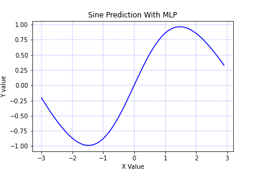
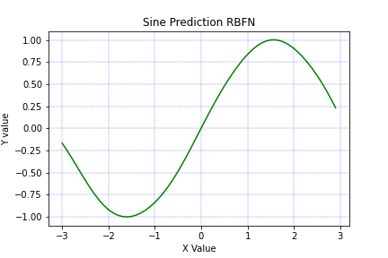
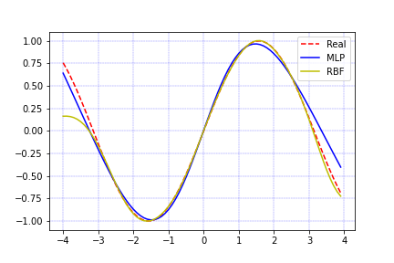

# Radial Basis Function (RBF)

## Description
Implementation of **Radial Basis Function** to predict sine function `sin(x)`

## Getting Started
### Dependencies
`keras`
\
`tensorflow`
\
`matplotlib`
\
`numpy`

### Executing

this implementation is on `ipynb` environment.I also offer you to run this on `google colab`

### Result
Here is result of `sin(x)` prediction with <ins>**MLP**</ins> in `[-3, 3]`.

result of `sin(x)` prediction with <ins>**RBF Network**</ins> in `[-3, 3]`.

Comparison of <ins>**RBF Network**</ins> prediction and <ins>**MLP**</ins> prediction and actual value of `sin(x)` in `[-4, 4]`:

### Authors
Amir Rezaei [@ameerezae](https://github.com/ameerezae)
